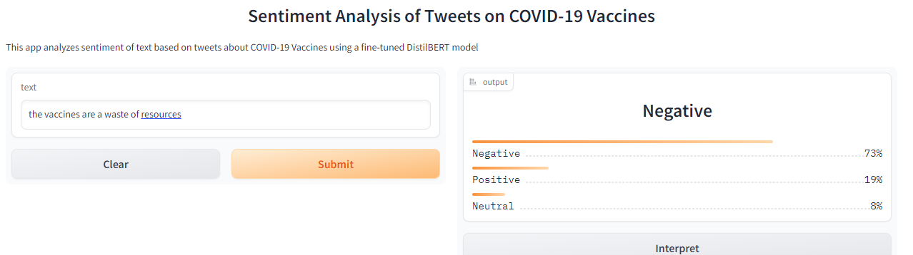
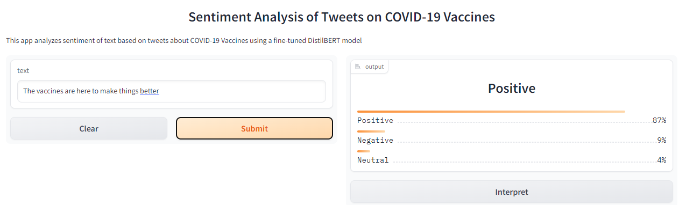

# Sentiment-Analysis
This is a Covid 19 sentiment analysis on the diverse nature of tweets to analyze the varied emotions of a large public towards covid 19. These sentiments are categorized into positive, negative and neutral tweets.
Sentiment analysis, also known as opinion mining, is a natural language processing technique used to analyze and determine the emotional tone or sentiment of a piece of text. Its purpose is to identify and extract subjective information from text data, such as attitudes, opinions, emotions, and intentions, and classify them into different categories such as positive, negative, or neutral. The analysis of sentiment has many applications in various fields such as business, politics, marketing, customer service, and social media monitoring, where understanding and interpreting people's opinions and attitudes towards products, services, events, or issues are crucial for decision-making. Sentiment analysis can be performed using different methods, including rule-based systems, machine learning algorithms, and deep learning models.
In this project, I have used Natural Language Processing (NLP) to analyze tweets and categorize them into positive, negative and neutral tweets. 
DistilBERT is a smaller and faster version of the BERT (Bidirectional Encoder Representations from Transformers) model, which is pre-trained on massive amounts of text data. In this Twitter Sentiment Analysis, DistilBERT was used to fine-tune a labeled dataset of tweets to predict the sentiment of a given tweet. The model was fine-tuned to classify tweets into three categories: positive, negative, or neutral, based on the tone of the tweet. DistilBERT takes the raw tweet text as input, and the output is a predicted sentiment label for that tweet. The fine-tuned DistilBERT model was used in a Gradio app to allow users to input a tweet and receive the predicted sentiment label as output. 
The Gradio app is a GUI (Graphical User Interface) for deploying Machine Learning models. It allows you to drag-and-drop images, text, and videos into the app, and click the button to predict the label.

Find below the link to a detailed article on the twitter sentiment analysis.
https://medium.com/@florentia.teye/twitter-sentiment-analysis-c5a649219dd9
 
 ## Author

**Name:** Florentia Teye

**GitHub:** [https://github.com/flokabukie)

**LinkedIn:** [Florentia Teye](https://www.linkedin.com/in/florentia-teye-75270a191/)

**Email:** florentiateye@gmail.com
florentia.teye@azubiafrica.org

Florentia Teye is a Data Analytics Professional with experience in data analysis and machine learning. She has a Bachelor's of Education degree in Mathematics and has worked on several open-source projects. In her free time, she enjoys teaching, researching new niches and writing. If you have any questions or suggestions, feel free to reach out to her on GitHub or LinkedIn.

Here is the link to the deployed app
https://huggingface.co/spaces/flokabukie/Twitter-gradio-sentiment-analysis-app